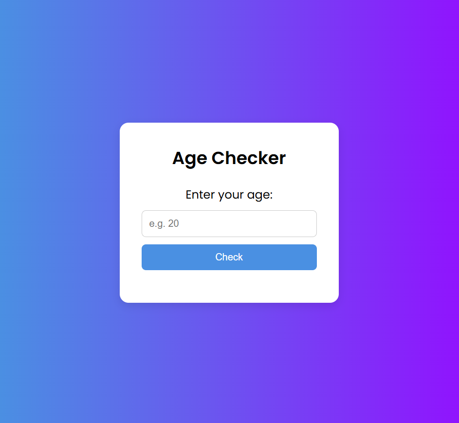

# age-checker
A simple JavaScript-based age checker app where users can input their age and check eligibility (18+).

## Features
- User enters age
- App displays "Eligible" if age > 18
- App displays "Not Eligible" if age < 18
- Clean and responsive design 
- Styled using CSS with modern layout

## Tech Stack
- HTML
- CSS
- JavaScript

## screenshot

## How to Use
1. Open `index.html` in browser
2. Enter your age
3. Click "Check" to see result